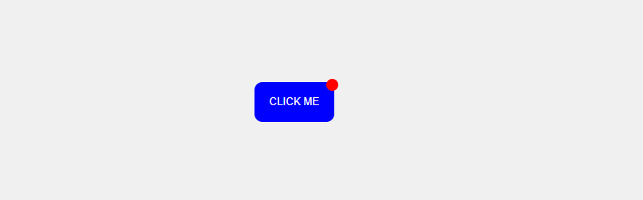

# Table of Contents
1. [Introduction to Positioning in CSS](#introduction-to-positioning-in-css)
2. [Types of Positioning](#types-of-positioning)
    - [Static Positioning](#static-positioning)
    - [Relative Positioning](#relative-positioning)
    - [Absolute Positioning](#absolute-positioning)
3. [Creating a Button with a Red Dot](#creating-a-button-with-a-red-dot)

---

## 1. Introduction to Positioning in CSS

CSS `position` property is used to control the layout and position of an element on a webpage. It determines how an element is placed in relation to its normal position or the viewport.

---

## 2. Types of Positioning

### Static Positioning
- **Definition**: This is the default positioning for all elements. A static element is positioned according to the normal flow of the document.
- **Effect**: The element will appear where it naturally sits in the HTML structure (i.e., top-to-bottom, left-to-right).

```css
.static-box {
  position: static;
}
```

## Relative Position

When you use `position: relative`, the element is positioned relative to its normal position. You can use the `top`, `right`, `bottom`, and `left` properties to move the element from where it would normally be.

- **Shifts element from its original position**.
- **Still occupies space in the document flow**.

### Example:
```css
div {
  position: relative;
  top: 20px;
  left: 50px;
  background-color: lightgreen;
  width: 100px;
  height: 100px;
}
```
## Absolute Position

With `position: absolute`, an element is positioned relative to its nearest positioned ancestor (i.e., an ancestor with a position other than `static`). If there is no such ancestor, it will be positioned relative to the `<html>` element.

- **Removed from the document flow**.
- **Does not affect the positioning of other elements**.

### Example:
```css
div {
  position: absolute;
  top: 50px;
  left: 100px;
  background-color: lightcoral;
  width: 100px;
  height: 100px;
}
```

## Creating a Button with a Red Dot

