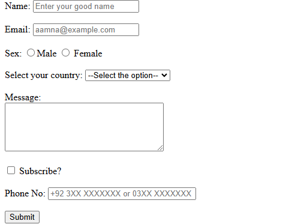

# Table of Contents

1. What is a Form in HTML
2. Input
3. Label
4. How to Connect Label to Input
5. Types of Input (color, text, date, submit)
6. The `name` Attribute and Why We Use It
7. The `value` Attribute and Why We Use It
8. Form Elements
9. Homework:
    - select 
   - `pattern` Attribute in Input
   - `maxlength`, `minlength`, and `size` in Text Input

---

# HomeWork

## input | select

## Form

