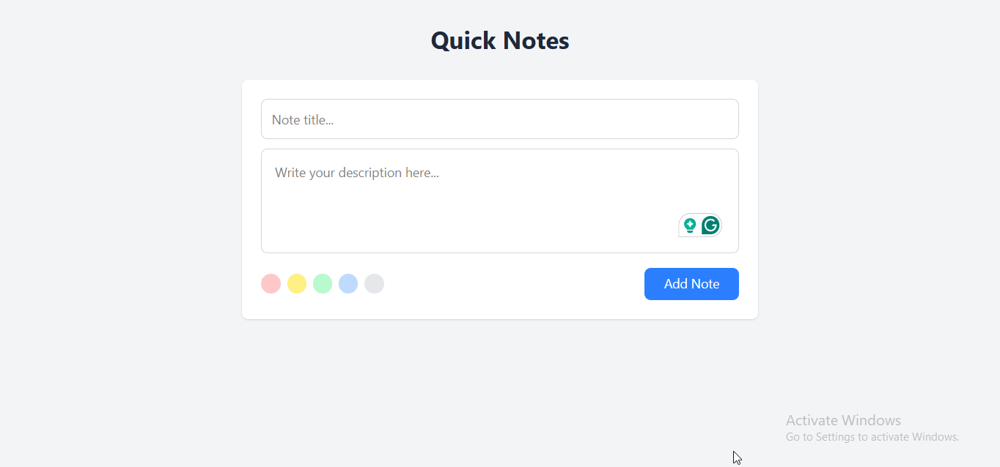

# [Note App](https://noteappfsd.netlify.app/)

A simple and intuitive note-taking app built with JavaScript, designed to help users easily add, edit, and delete their notes. 

## Features

- **Add Notes**: Quickly create new notes with titles and content.
- **Edit Notes**: Modify your existing notes at any time.
- **Delete Notes**: Easily remove any note.
- **Responsive Design**: Fully responsive layout that works on both desktop and mobile devices.

## Demo

NoteApp: [Please click here to see me live ](https://noteappfsd.netlify.app/)

